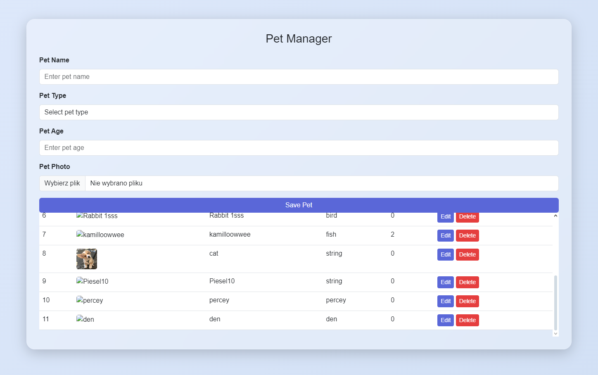

# 🚀 Laravel Project with Docker Support


- This project was created as a recruitment task.
- File uploads currently do not work as expected due to an issue with generating URLs. The resulting links look like this:
  ```
  "http:\/\/localhost\/storage\/pets\/up1xMlZJCIR1fFCGkdUYxQAkPDa02JQNLgzdpqKo.png"
  ```
- The project was developed using **Sail on Windows**, so ensure compatibility if running on a different OS.


---



---

## 🐳 Getting Started with Docker

### Prerequisites

Make sure you have the following installed:
- **Docker** (https://www.docker.com/)
- **Docker Compose** (comes with Docker Desktop)

### Quick Start

1. Clone this repository:
   ```bash
   git clone <repository_url>
   cd <repository_folder>
   ```

2. Install dependencies:
   ```bash
   composer install
   ```

3. Start the application:
   ```bash
   ./vendor/bin/sail up
   ```

   This command will:
   - Build and start all Docker containers.
   - Set up the application environment.

4. Run migrations to set up the database:
   ```bash
   ./vendor/bin/sail artisan migrate
   ```

5. Access the application at:
   - **Frontend:** http://localhost

This project integrates with the **[Petstore Swagger API](https://petstore.swagger.io/#/)** for managing pet-related data.

---

## 🌟 Features

- **Dockerized Environment**: Easily run the application using Sail, Laravel's Docker development environment.
- **Preconfigured Storage**: Manage uploaded files using the Laravel `storage` system.
- **Integration with Petstore API**: Fetch and manage pet data through the external API.

---

## 🛠 Configuration

1. **Environment Variables**
   Update the `.env` file with your custom settings. Example:
   ```env
   APP_NAME=Laravel
   APP_URL=http://localhost
   ```

2. **Storage Link**
   If file uploads are used, ensure the storage link is created:
   ```bash
   ./vendor/bin/sail artisan storage:link
   ```

3. **Migrations**
   Run migrations to set up the database:
   ```bash
   ./vendor/bin/sail artisan migrate
   ```

---

## 🚧 Common Commands

Here are some helpful commands for managing the project:

- **Run migrations**:
  ```bash
  ./vendor/bin/sail artisan migrate
  ```

- **Seed the database**:
  ```bash
  ./vendor/bin/sail artisan db:seed
  ```

- **Access the Tinker shell**:
  ```bash
  ./vendor/bin/sail artisan tinker
  ```

- **Stop containers**:
  ```bash
  ./vendor/bin/sail down
  ```

---

## 📝 Notes

- This project was created as a recruitment task.
- File uploads currently do not work as expected due to an issue with generating URLs. The resulting links look like this:
  ```
  "http:\/\/localhost\/storage\/pets\/up1xMlZJCIR1fFCGkdUYxQAkPDa02JQNLgzdpqKo.png"
  ```
- For production deployment, additional steps like configuring a web server (e.g., Nginx) and SSL certificates are required.
- The project was developed using **Sail on Windows**, so ensure compatibility if running on a different OS.

---


Enjoy coding! 🎉

